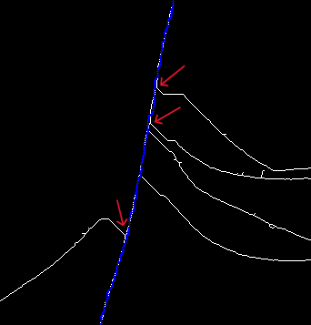
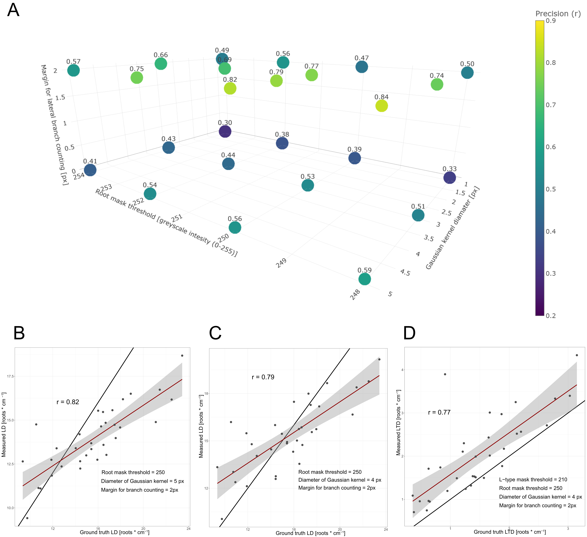

# Rice lateral root phenotyping tool 

This project contains the implementation of the semi-automated rice root phenotyping tool described in Krusenbaum et. al, 2026 (To be submitted).

## Requirements
- Python 3.8+
- Pillow
- numpy
- opencv-python
- plantcv
- tkinter (bundled with CPython on most platforms)

## How to run
1. Place this project in a folder `RiceLateralRootPhenotypingTool`.
2. Install dependencies, e.g. `pip install pillow numpy opencv-python plantcv`.
3. Run: `python RiceLateralRootPhenotypingTool/app.py`
4. Use File → Open File to load images and the right-side controls to create masks / skeletons.
5. Follow in-depth instructions given in the top right hand panel.

## Introduction

This software can be used to obtain phenotypic data of lateral root traits from rice root scans. Please refer to ./ExampleImages as reference to what these scans should look like. Using this software the following traits can be measured in a semi-automated manner:
main root axis length (MRL),
single S-type length (STL),
single L-type length (LTL),
S-type number on single L-type,
Lateral root number on main root,
L-type lateral root number on main root. 
From these measurements lateral root densities (Both for S- and L-type) on main roots (STD, LTD) and L-types can be calculated (STDonLT).

## Detailed explaination of the pipeline

First, two binary representations of a greyscale root scan are generated: A root mask and an L-type mask. Both masks are generated by employing two separate, user-defined thresholds. The root mask is generated by a higher threshold. This should be chosen such that all root structures, including S-type laterals, remain clearly visible. The L-type mask is generated using a lower threshold, such that S-type laterals are mostly suppressed while L-type laterals remain mostly visible. Prior to thresholding, a Gaussian blur is applied to the greyscale root scan to eliminate the influence of random intensity fluctuations on root edges. The diameter of the Gaussian kernel is provided by the user.
Please refer to the below images for reference of what the rootmask and LT-mask should look like.

From the root mask, a skeletonized representation is generated. Skeletonization, as well as subsequent detection of skeleton tips and branch points, is performed using the Python package PlantCV (Schuhl et al., 2026). The skeleton provides a simplified representation of the root architecture that is employed in subsequent pathfinding and measurements.
Within the root skeleton, users can select the two tips of a main root axis. The shortest path between these two points is computed by A* search (Hart et al., 1968) treating every white pixel in the skeleton as a node and using the Euclidean distance to the target root tip as a heuristic. This implementation is similar to the navigation in root datasets employed by RootNav (Pound et al., 2013). In some cases, the shortest path may not coincide with the actual main root axis due to shortcuts in the skeleton created by lateral or crown roots. Users may define additional waypoint positions to address this. The main root axis path is then computed by iteratively applying A* search between consecutive waypoints. 
Paths for S-type and L-type laterals can be computed by a similar approach using A* search once the main root axis path is established. In this case, the start point is a lateral root tip provided by the user. The goal is defined as any point along the main root axis path. A* search is implemented using the minimum Euclidean distance to any point in the main root axis path as a heuristic. As for the main root axis users may provide additional waypoints to guide pathfinding when the shortest path does not reflect the actual lateral root geometry.
Root lengths are computed as the sum of Euclidean distances along the corresponding root paths and converted to physical units using the image resolution. Lateral root numbers along the main root axis as well as along L-type laterals are estimated by the number of skeleton branch points that fall within a user-defined vicinity of a given root path. For the main root axis, these counts comprise the combined number of both S- and L-type laterals. To estimate the number of L-type laterals along the main root axis specifically, a dilated line is drawn along the main root axis into the L-type mask. This is done to remove artifacts caused by residual S-type roots, not fully suppressed during thresholding. Skeletonization and branch point detection are then applied to the L-type mask as previously described. L-type counts along the main root axis are subsequently estimated as the number of branch points in this L-type skeleton that fall within a user-defined vicinity of the main root axis path. Due to the dilation step, branch points may be distributed more broadly around the path; therefore, this vicinity should be selected less conservatively than for branch point counting on the root skeleton. Please refer to the following images for reference.

While this pipeline speeds up length measurements for roots and counting of lateral roots. It might still produce erroneous results in particularly noisy areas of the root system. Therefore, users have the option to manually modify, e.g., the number of counted roots when the extracted counts are clearly unreasonable.

## Calibration

As the number of S-types and L-types counted by the pipeline is sensitive to several input parameters (root mask threshold, L-type mask threshold, Gaussian kernel diameter, and margin for lateral branch counting), these parameters were calibrated on a set of 33 randomly selected scans from replicate 1 of the hydroponics set. Lengths of the primary root axis were measured using ImageJ (Schneider et al., 2012), and the number of all laterals and L-types along the primary root was counted manually. From this, lateral and L-type densities (LD, LTD) were calculated. The same images were analyzed by the semi-automated pipeline while systematically varying the aforementioned parameters.
In  general, employing a margin for branch counting with a diameter of 2 pixels resulted in higher correlations between ground-truth and measured LD values compared to not applying such a margin (Figure below A). Although the highest precision for LD was observed for root mask thresholds of 248, this threshold frequently truncated S-type laterals, thereby interfering with measurements of S-type lengths. A root mask threshold of 250 was therefore considered more appropriate. At this threshold, the highest precision for LD was achieved using a Gaussian kernel diameter of 5 pixels; however, this setting led to a systematic underestimation of LD (Figure below B). Consequently, a Gaussian kernel diameter of 4 pixels was selected, providing a better balance between precision and bias (Figure Below C).
Using these parameter values, precision for LTD was evaluated by fixing the margin for L-type branch counting at 10 pixels and varying the L-type mask threshold while keeping all other parameters constant. The highest precision was observed for an L-type mask threshold of 210 with only a slight tendency to overestimate LTD (Figure below D). 

Note that depending on the type of dataset (brightness, amount of debris etc.) additional calibration might be needed.

## References

Hart, P. E., Nilsson, N. J., & Raphael, B. (1968). A Formal Basis for the Heuristic Determination of Minimum Cost Paths. IEEE Transactions on Systems Science and Cybernetics, 4(2), 100–107. https://doi.org/10.1109/TSSC.1968.300136

Pound, M. P., French, A. P., Atkinson, J. A., Wells, D. M., Bennett, M. J [Malcolm J.], & Pridmore, T. (2013). Rootnav: Navigating images of complex root architectures. Plant Physiology, 162(4), 1802–1814. https://doi.org/10.1104/pp.113.221531

Schneider, C. A., Rasband, W. S., & Eliceiri, K. W. (2012). NIH Image to ImageJ: 25 years of image analysis. Nature Methods, 9(7), 671–675. https://doi.org/10.1038/nmeth.2089

Schuhl, H., Brown, K. E., Sheng, H., Bhatt, P. K., Gutierrez, J., Schneider, D., Casto, A. L., Acosta‐Gamboa, L., Ballenger, J. G., Barbero, F., Braley, J., Brown, A. M., Chavez, L., Cunningham, S., Dilhara, M., Dimech, A. M., Duenwald, J. G., Fischer, A., Gordon, J. M., . . . Fahlgren, N. (2026). PlantCV v4: Image analysis software for high‐throughput plant phenotyping. The Plant Phenome Journal, 9(1), Article e70065. https://doi.org/10.1002/ppj2.70065

## Acknowledgements
Basic functions of image viewing, zooming and moving have been adopted and modified from: https://github.com/ImagingSolution/PythonImageViewer
This project used OpenAI’s ChatGPT in November 2025 to assist with implementation of basic functions, bug fixes, and improvements to the project structure. All AI-assisted changes were reviewed, tested, and integrated by the project maintainer.
